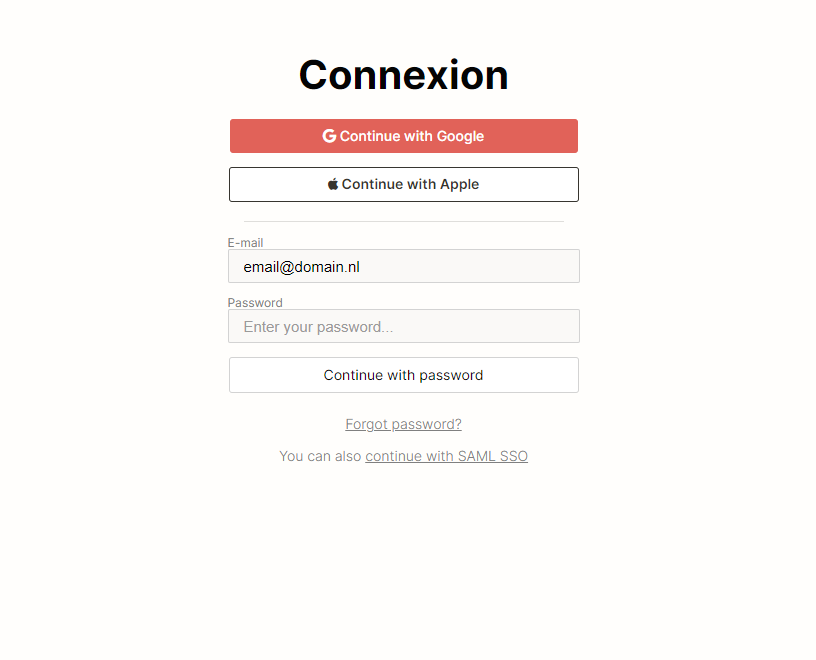

<h2 align="center"> ━━━━━━  ❖  ━━━━━━ </h2>

<!-- BADGES -->

   

   
      

      

   
   
   
    

---

### ❖ Information 

Training front-end by redoing the notion login page by myself trying as much as possible not to use the browser inspector 🌱

**Disclaimer:** This repository is just for learning purpose, I discourage any use of this for illegal action. 

---

### ❖ Screenshots

